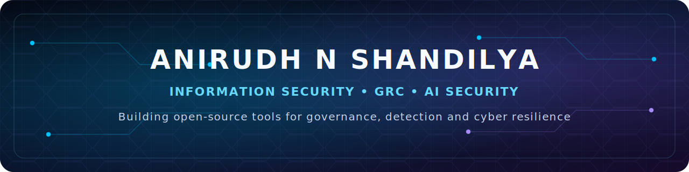

  

  

  I build practical open-source cybersecurity tools that simplify compliance,
  strengthen detection and turn security data into actionable decisions.

  
  
  

---

## About Me

- Information Security Analyst based in the United Kingdom.
- Focused on **Governance, Risk & Compliance**, **Detection Engineering** and **AI Security**.
- Experienced with **ISO/IEC 27001:2022**, **NIST CSF**, ITGC audits, risk assessments and security operations.
- Building security tooling with **Python**, **FastAPI**, **SQL** and applied machine learning.
- MSc Cybersecurity graduate from the **University of York**.
- Interested in practical research at the intersection of AI, cyber risk and defensive security.

---

## Featured Projects

### [AuditPilot](https://github.com/anirudhnshandilya/auditpilot)
> AI-powered ISO/IEC 27001 readiness platform for evidence management, control tracking, corrective actions and audit preparation.

`Python` `FastAPI` `SQLite` `GRC` `ISO/IEC 27001`

### [ThreatWeaver](https://github.com/anirudhnshandilya/ThreatWeaver)
> Security graph engine for modelling infrastructure relationships and producing evidence-backed attack paths.

`Python` `FastAPI` `Graph Analysis` `Detection Engineering`

### SentinelTriage
> Local-first authentication-log analysis platform that combines rules, anomaly detection, risk explanations and MITRE ATT&CK mapping.

`Python` `Pandas` `scikit-learn` `MITRE ATT&CK` `FastAPI`

### LLM TrustCheck
> RoBERTa-based phishing email detection project designed to support faster and more consistent analyst triage.

`Transformers` `PyTorch` `NLP` `AI Security`

---

## Security & Engineering Stack

### Governance, Risk and Compliance

### Security Operations

### Engineering and Data

---

## Current Focus

- Shipping **AuditPilot**, **ThreatWeaver** and **SentinelTriage** as portfolio-quality open-source security products.
- Exploring AI-assisted GRC, explainable security analytics and local-first defensive tooling.
- Researching LLM security, detection engineering and cyber-risk decision systems.
- Improving project documentation, automated testing and developer experience.

---

## Research

**Research interests:** AI for Cybersecurity · LLM Security · Security Analytics · GRC Automation · Detection Engineering · Cloud Security

**Publication**

- *Mental Health Analysis Using Machine Learning* — IEEE, 2023

**Ongoing work**

- Theoretical and applied research across AI security, cyber-risk modelling and defensive security systems.

---

## Certifications

---

## GitHub Activity

  

  

> Dynamic cards depend on third-party services and may occasionally be rate-limited. The profile remains complete even when a card is temporarily unavailable.

---

## Let's Connect

  <a href="https://www.linkedin.com/in/anirudhshandilya">LinkedIn</a>
  ·
  <a href="https://www.unimad.ai/portfolio/anirudhns">Portfolio</a>
  ·
  <a href="mailto:anirudhns29@gmail.com">Email</a>

  Building security tools that make governance clearer, detection stronger and cyber risk easier to act on.

